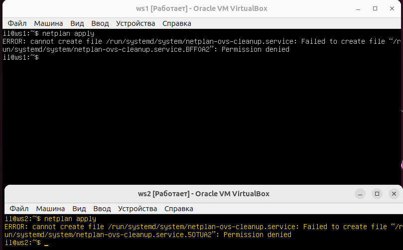
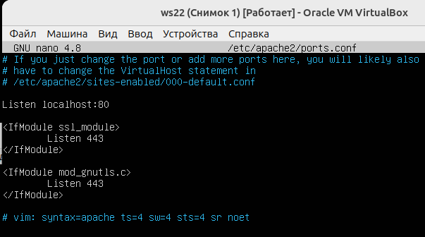

## 1. Инструмент **ipcalc**
**1.1. Сети и маски**

    ipcalc предоставляет простой метод для вычисления IP-информации хоста.

__**Определить и записать в отчёт:**__

**1**) Сетвой адрес сети 192.167.38.54/13

    

Скриншот   `ipcalc 192.167.38.54/13`

    ADRESS - сам адрес хоста.
    NETMASK - Это маска подсети, которая определяет, какие биты IP-адреса относятся к сети, а какие - к устройствам внутри сети.
    Wildcard - Это обратная маска, которая используется для определения диапазона адресов хостов в данной сети.
    NETWORK - сетевой адрес.Это адрес, который определяет начало данной сети. 
    HOSTMIN - первый доступный хост. Он обычно равен Network Address + 1
    HOSTMAX - последний доступный хост.Он обычно равен Broadcast - 1.
    BROADCAST -  широковещательный адрес.
    HOSTS - это количество доступных адресов хостов в данной сети. Он вычисляется как разница между HostMax и HostMin, плюс один (если учесть сетевой адрес). 
    "Class C" в контексте сетей и хостов обычно означает классификацию сети IPv4. Классификация сетей IPv4 основана на диапазонах IP-адресов и используется для определения того, какой части IP-адреса принадлежит сеть, а какой - устройству (хосту) внутри этой сети. Класс C сетей - это один из классов классификации. Класс C (от 192.0.0.0 до 223.255.255.0): Этот класс предназначен для маленьких сетей с небольшим числом устройств. Первые три байта адреса отведены для идентификации сети, а последний байт - для хостов.

**2**) Перевод маски 255.255.255.0 в префиксную и двоичную запись, /15 в обычную и двоичную, 11111111.11111111.11111111.11110000 в обычную и префиксную

Скриншот `ipcalc 255.255.255.0` в префиксной и двоичной записи. 

Скриншот `ipcalc /15` в обычную и двоичную записи. 

Перевод **11111111.11111111.11111111.11110000** в обычную запись. 

**11110000** в двочиной - это 240 в десятичной.

**11111111** в двочиной - это 255 в десятичной.

**255.255.255.240** - в обычной записи.

Перевод **11111111.11111111.11111111.11110000** в префиксную запись.

    Для перевода IP-адреса из двоичной записи в префиксную запись,  нужно определить длину сетевой маски, которая представляет количество единиц в двоичной записи. В данном случае, у нас есть 28 единиц в двоичной записи.

Т.о.  префиксная запись будет **/28**.

**3**) Минимальный и максимальный хост в сети 12.167.38.4 при масках: /8, 11111111.11111111.00000000.00000000, 255.255.254.0 и /4

Скриншот `ipcalc 12.167.38.4/8`.

HostMin:  12.0.0.1

HostMax:  12.255.255.255

Скриншот `ipcalc 12.167.38.4/16`.

11111111.11111111.00000000.00000000 это маска /16.

HostMin:  12.167.0.1

HostMax:  12.167.255.254

Скриншот  `ipcalc 12.167.38.4/255.255.254.0`.

HostMin:  12.167.38.1

HostMax:  12.167.39.254

Скриншот  `ipcalc 12.167.38.4/4`.

HostMin: 0.0.0.1

HostMax: 15.255.255.254

**1.2. localhost**

Определить и записать в отчёт, можно ли обратиться к приложению, работающему на localhost, со следующими IP: 194.34.23.100, 127.0.0.2, 127.1.0.1, 128.0.0.1

    Loopback (петля) - это особый адрес в компьютерных сетях, который используется для установления сетевой связи на самом устройстве, на котором он находится.

Mожно обратиться к приложению на localhost с IP-адресами 127.0.0.2 и 127.1.0.1 (присутсвует LoopBack)

Нельзя обратиться к приложению на localhost с IP-адресами 194.34.23.100 и 128.0.0.11.3. Диапазоны и сегменты сетей

**1.3. Диапазоны и сегменты сетей**

1) Какие из перечисленных IP можно использовать в качестве публичного, а какие только в качестве частных: 10.0.0.45, 134.43.0.2, 192.168.4.2, 172.20.250.4, 172.0.2.1, 192.172.0.1, 172.68.0.2, 172.16.255.255, 10.10.10.10, 192.169.168.1

        Для IPv4 существуют три основных диапазона частных адресов:
        10.0.0.0 - 10.255.255.255 (10.0.0.0/8)
        172.16.0.0 - 172.31.255.255 (172.16.0.0/12)
        192.168.0.0 - 192.168.255.255 (192.168.0.0/16)
        Если IP-адрес находится в одном из этих диапазонов, то он является частным.

        IPv6 частные адреса: Для IPv6 существует диапазон частных адресов, который обозначается как fc00::/7. Если IPv6-адрес начинается с fc00::, то он также считается частным.

**В качестве публичных можно использовать :
134.43.0.2
172.0.2.1
192.172.0.1
172.68.0.2
192.169.168.1**

**В качестве частных можно использовать ("Private internet"):
10.0.0.45
192.168.4.2
172.20.250.4
172.16.255.255
10.10.10.10**

 2) какие из перечисленных IP адресов шлюза возможны у сети 10.10.0.0/18: 10.0.0.1, 10.10.0.2, 10.10.10.10, 10.10.100.1, 10.10.1.255

Шлюз имеет IP-адрес, который находится в той же подсети, что и устройства в локальной сети.

 

    Сеть 10.10.0.0/18 имеет диапазон IP-адресов от 10.10.0.1 до 10.10.63.254.

 10.10.0.2, 10.10.10.10, 10.10.1.255 могут быть возможными шлюзами для сети 10.10.0.0/18.

 10.0.0.1, 10.10.100.1 не могут быть шлюзами для сети 10.10.0.0/18.

## 2. Статическая маршрутизация между двумя машинами
-  С помощью команды `ip a` посмотреть существующие сетевые интерфейсы
 *ip a* 

>* Описание сетевого интерфейса, соответствующего внутренней сети:
 

**lo**: это имя интерфейса, и оно означает "loopback" или "петля".

**<LOOPBACK,UP,LOWER_UP>**: это описание состояния интерфейса. "UP" и "LOWER_UP" указывают на то, что интерфейс включен и активен.

**mtu 65536**: это максимальный размер передаваемого кадра для этого интерфейса.

**qdisc noqueue**: это информация о дисциплине очереди (Queueing Discipline), которая в данном случае указывает, что для этого интерфейса не используется очередь.

**state UNKNOWN**: состояние интерфейса неизвестно.

**group default qlen 1000**: это связанные параметры.

**Link/ Loopback 00:00:00:00:00:00 brd 00:00:00:00:00:00.**

Это информация о сетевой карте интерфейса "lo" и ее MAC-адресе (00:00:00:00:00:00).

**inet 127.0.0.1/8 scope host lo**

Это информация о IPv4-адресе для интерфейса "lo". IP-адрес 127.0.0.1 - это адрес loopback, который используется для внутренних коммуникаций на устройстве.

scope host указывает, что этот адрес относится только к данному устройству.

**valid_lft forever preferred_lft forever**

Эти строки указывают, что срок действия (lifetime) адреса бесконечный, и этот адрес всегда предпочтительный.

**inet6 ::1/128 scope host**

Это информация о IPv6-адресе для интерфейса "lo". IPv6-адрес "::1" также является адресом loopback для IPv6.

**valid_lft forever preferred_lft forever**

Аналогично предыдущему, срок действия этого адреса бесконечный, и он всегда предпочтительный.

**enp0s3: <BROADCAST,MULTICAST,UP,LOWER_UP> mtu 1500 qdisc fq_codel state UP group default qlen 1000**

**enp0s3**: это имя сетевого интерфейса, который, по-видимому, является физическим сетевым интерфейсом.

<BROADCAST,MULTICAST,UP,LOWER_UP>: это описание состояния интерфейса, которое говорит о том, что интерфейс включен и активен, и он поддерживает широковещательные и многоадресные (multicast) пакеты.

**mtu 1500**: это максимальный размер передаваемого кадра для этого интерфейса. Здесь MTU равен 1500, что является стандартным значением для Ethernet.

**qdisc fq_codel**: это информация о дисциплине очереди, которая используется для управления пакетами на этом интерфейсе.

**state UP**: интерфейс включен и активен.

**group default qlen 1000:** связанные параметры интерфейса.

**Link/ether 08:00:27:27:ba:88 brd ff:ff:ff:ff:ff:ff** 

Это информация о сетевой карте интерфейса "enp0s3" и его MAC-адресе (08:00:27:27:ba:88).

**inet 10.0.2.15/24 brd 10.0.2.255 scope global dynamic enp0s3**

Это информация о IPv4-адресе для интерфейса "enp0s3". IP-адрес 10.0.2.15 является глобальным IP-адресом сети с подсетью /24.

**brd 10.0.2.255** указывает на широковещательный адрес для этой подсети.

**scope global** говорит о том, что этот адрес является глобальным для устройства.

**dynamic** указывает на то, что этот адрес был назначен динамически, возможно, через DHCP.

**valid_lft 86261sec preferred_lft 86261sec**

Срок действия этого IPv4-адреса ограничен 86261 секундой, и он предпочтителен в течение всего этого времени.

**inet6 fe80::a00:27ff:fe27:ba88/64 scope link**

Это информация о локальном (link-local) IPv6-адресе для интерфейса "enp0s3". Этот адрес используется для общения на локальной сети и не маршрутизируется в Интернет.

**valid_lft forever preferred_lft forever**

Срок действия этого IPv6-адреса бесконечный, и он всегда предпочтителен.

> * задать следующие адреса и маски: ws1 - 192.168.100.10, маска /16, ws2 - 172.24.116.8, маска /12
> 
Используем \-
`sudo nano /etc/netplan/00-installer-config.yaml`

 *netplan* 

> *Выполнить команду netplan apply для перезапуска сервиса сети
>

Проверяем  при помощи `ip a`

2.1. Добавление статического маршрута вручную

1)Добавьте статический маршрут от одной машины к другой и обратно

    Команда "ip r add" используется в операционной системе Linux для добавления новой маршрутизации в таблицу маршрутизации IP. Эта команда позволяет добавить новый маршрут, указав целевую сеть или хост, шлюз по умолчанию и другие параметры маршрута.

\-
`sudo ip r add 192.168.100.10 dev enp0s8`

\-
`sudo ip r add 172.24.116.8 dev enp0s8`

 *static_route* 

2.2. Добавление статического маршрута с сохранением
 
  Перезапустил обе машины командой `reboot`

- Добавить статический маршрут от одной машины до другой с помощью файла etc/netplan/00-installer-config.yaml и пропинговать соединение между машинами 
  
`sudo nano /etc/netplan/00-installer-config.yaml`

      routes - это раздел для настройки статических маршрутов. Здесь мы настраиваем маршрут для подсети 172.24.116.8 через шлюз 192.168.100.10. 

      routes:
        - to: 172.24.116.8  # Целевая подсеть, для которой настраивается маршрут
          via: 192.168.100.10  # IP-адрес шлюза для маршрута
          В нашем случае шлюзом служит сам ws1.

 *netplan* 

Далее `sudo netplan apply`  и пингуем машины.

 *ping* 

## 3.Утилита iperf3

 3.1. Скорость соединения

    iperf3 - это инструмент командной строки для тестирования скорости сети. Он позволяет измерять пропускную способность и задержку сетевого соединения между двумя узлами.

- Перевести и записать в отчёт: 8 Mbps в MB/s, 100 MB/s в Kbps, 1 Gbps в Mbps

Конвертация скоростей передачи данных:

   **8 Mbps в MB/s**: 
   
   Для преобразования мегабитов в мегабайты необходимо разделить значение на 8 (поскольку 1 байт равен 8 битам): 8 Mbps = 8 / 8 = 1 MB/s\
      Скорость 8 Mbps эквивалентна 1 MB/s.

   100 MB/s в Kbps: 1 Мегабайт (MB) = 8 Мегабит (Mb)

1 Килобайт (KB) = 8 Килобит (Kb)

**100 MB/s в Kbps**:

100 MB/s * 8 (перевод из МБ в Мб) * 1000 (перевод из Мб в Кб) = 800,000 Kbps

Таким образом, 100 MB/s равно 800,000 Kbps.

   **1 Gbps в Mbps**: 
   
   Для перевода гигабитов в мегабиты необходимо умножить значение на 1000 (поскольку 1 гигабит равен 1000 мегабитам): 1 Gbps = 1 * 1000 = 1000 Mbps\
     Скорость 1 Gbps эквивалентна 1000 Mbps.
   
3.2. Утилита iperf3

    Утилита iperf - это генератор сетевого трафика, предназначенный для проверки скорости и пропускной способности сети./

Установока утилиты iperf3 командой:
\-
`sudo apt install iperf3`

Поскольку утилита имеет как серверную часть так и клиентскую, надо рассматривать обе отдельно. Для запуска сервера используется такой синтаксис:

$ iperf3 -s опции

Для запуска клиента используется ключ -c, которому надо передать адрес сервера:

$ iperf3 -c адрес_сервера опции -R, --reverse - обратный тест, не клиент отправляет данные серверу, а сервер клиенту;

* `iperf3 -s` (ws1)
* `iperf3 -c 192.168.100.10 -R` (ws2)

 *iperf3* 

*  Скорость =4.89 Gbits/sec

## 4.Сетевой экран
#### 4.1. Утилита **iptables**

Создайте файл /etc/firewall.sh , имитирующий брандмауэр на ws1 и ws2:

\-
`nano /etc/firewall.sh`  *firewall.dh* 

ТЕОРИЯ

    iptables -F: Эта команда очищает (flush) все правила (rules) в таблице фильтрации (filter table) брандмауэра. Таблица фильтрации используется для управления тем, какие сетевые пакеты разрешены или блокируются на системе. После выполнения этой команды, все текущие правила будут удалены, и брандмауэр будет разрешать все сетевые пакеты по умолчанию.

    iptables -X: Эта команда удаляет (delete) все пользовательские цепи (user-defined chains) в таблице фильтрации. Цепи используются для группировки правил и организации более сложных конфигураций брандмауэра. После выполнения этой команды, все пользовательские цепи будут удалены.

     Запрещающее правило
        iptables -P OUTPUT DROP -  устанавливает политику (policy) для цепочки OUTPUT в таблице iptables на значение DROP. Это означает, что все исходящие пакеты будут отбрасываться по умолчанию, если не будет существовать правило, которое разрешает их прохождение.
        
    При установке политики OUTPUT в DROP все исходящие пакеты будут отбрасываться по умолчанию, если нет явных правил, разрешающих отправку пакетов. Это означает, что компьютер с такой настройкой iptables не сможет инициировать исходящие соединения или отправлять сетевые пакеты.
        
    Разрешающее правило для порта 22 (ssh)
        iptables -A OUTPUT -p tcp --dport 22 -j ACCEPT - добавляет правило в цепочку OUTPUT брандмауэра, которое разрешает TCP-трафик на порту 22 (SSH).
        
    Разрешающее правило для порта 80 (http)
        iptables -A OUTPUT -p tcp --dport 80 -j ACCEPT
        
    Разрешающее правило для исходящего эхо-ответа
        iptables -A OUTPUT -p icmp --icmp-type echo-reply -j ACCEPT
    
    "--dport 22": представляет собой параметр для определения порта назначения (destination port). Это используется для фильтрации и маршрутизации сетевых пакетов на основе номера порта, указанного в поле назначения заголовка TCP или UDP. В данном случае --dport 22 означает, что правило iptables будет применяться только к пакетам с портом назначения 22.
    "-p tcp":  указывает, что правило применяется к пакетам TCP. TCP (Transmission Control Protocol) является протоколом передачи данных, который обеспечивает надежное установление соединения и гарантирует доставку данных.
    "-A OUTPUT": это указывает, что правило будет применяться к цепочке OUTPUT, которая обрабатывает пакеты, исходящие из вашей системы.
    "-p icmp": ограничивает применение правила только к пакетам протокола ICMP (Internet Control Message Protocol), который используется для управления сетью и передачи диагностических сообщений.
    "--icmp-type echo-reply": устанавливает условие, что это правило будет применяться только к ICMP-пакетам с типом "echo-reply". Тип "echo-reply" является ответным сообщением на запрос "ping".
    "-j ACCEPT": определяет действие, которое будет выполнено, когда соответствие правилу найдено. В данном случае, пакеты соответствующие этому правилу будут приняты (разрешены) и продолжат свой путь.

 *ws1 & ws2 firewall* 

На обоеих машинах применяем правила:
 * `sudo chmod +x /etc/firewall.sh` 
 * `sudo bash /etc/firewall.sh`

 *chmod +x & bash* 

 * `ping`

 *ping* 

ws1 машиной  ws2  не пингуется так как срабатывает установленный в настройках ws1 DROP. Разница между стратегиями - для того, чтобы одна машинга пинговалась, а вторая нет, не обязательно писать обе строки, так как правила обрабатываются в порядке их написания, тоесть работать будет та строка которая написана выше.

#### 4.2. Утилита **nmap**
    Nmap (Network Mapper) - это инструмент сканирования сети, который широко используется в операционных системах Linux. Он предоставляет возможность изучать и анализировать сетевые хосты, определять открытые порты, обнаруживать службы, запущенные на удаленных компьютерах, а также выполнять другие задачи, связанные с сетевой безопасностью.

##### Командой **ping** найти машину, которая не "пингуется", после чего утилитой **nmap** показать, что хост машины запущен
*Проверка: в выводе nmap должно быть сказано: `Host is up`*
- В отчёт поместить скрины с вызовом и выводом использованных команд **ping** и **nmap**.

##### Сохранить дампы образов виртуальных машин
**p.s. Ни в коем случае не сохранять дампы в гит!**

 `sudo apt install nmap` 
* `ping`
 
 *ping & host is up* 

* Машина -> Сделать снимок 

## 5.Статическая маршрутизация сети

**== Задание 5.0 ==**

##### Поднять пять виртуальных машин (3 рабочие станции (ws11, ws21, ws22) и 2 роутера (r1, r2))

**Выполнение**

Поднял 5 машин и обьединил их соответствующим образом.

 *VirtualBox ws11* 

 *VirtualBox ws21* 

 *VirtualBox ws22* 

 *VirtualBox r1* 

 *VirtualBox r2* 

**== Задание 5.1 ==**

#### 5.1. Настройка адресов машин
##### Настроить конфигурации машин в *etc/netplan/00-installer-config.yaml* согласно сети на рисунке.
- В отчёт поместить скрины с содержанием файла *etc/netplan/00-installer-config.yaml* для каждой машины.
##### Перезапустить сервис сети. Если ошибок нет, то командой `ip -4 a` проверить, что адрес машины задан верно. Также пропинговать ws22 с ws21. Аналогично пропинговать r1 с ws11.
- В отчёт поместить скрины с вызовом и выводом использованных команд.

**Выполнение**
* Cодержание файла *etc/netplan/00-installer-config.yaml* для каждой машины:

 *VirtualBox ws11* 

 *VirtualBox ws21* 

 *VirtualBox ws22* 

 *VirtualBox r1* 

 *VirtualBox r2* 

* `sudo netplan apply `
* `ip -4 a`
  

 *ws11* 

 *ws21* 

 *ws22* 

 *r1* 

 *r2* 

* ping ws21 - ws22
  
 *ws21 - ws22* 

* ping ws11 - r1

 *ws11 - r1* 

**== Задание 5.2 ==**

#### 5.2. Включение переадресации IP-адресов.
##### Для включения переадресации IP, выполните команду на роутерах:
`sysctl -w net.ipv4.ip_forward=1`
*При таком подходе переадресация не будет работать после перезагрузки системы.*
- В отчёт поместить скрин с вызовом и выводом использованной команды.
##### Откройте файл */etc/sysctl.conf* и добавьте в него следующую строку:
`net.ipv4.ip_forward = 1`
*При использовании этого подхода, IP-переадресация включена на постоянной основе.*
- В отчёт поместить скрин с содержанием изменённого файла */etc/sysctl.conf*.

**Выполнение**

* `sudo sysctl -w net.ipv4.ip_forward=1`

        Команда sysctl -w net.ipv4.ip_forward=1 используется в операционной системе Linux для изменения значения параметра net.ipv4.ip_forward в реестре ядра (kernel). Этот параметр определяет, будет ли ядро Linux пересылать пакеты между разными сетевыми интерфейсами в системе. Давайте разберем, что означает эта команда:

        sysctl: Это инструмент в Linux, который используется для динамической настройки различных параметров ядра и сети.

        -w: Этот флаг указывает sysctl на то, что мы хотим изменить значение параметра.

        net.ipv4.ip_forward: Это путь к параметру в реестре ядра, который контролирует пересылку IPv4-пакетов между сетевыми интерфейсами. Когда этот параметр установлен в 1, ядро разрешает пересылку пакетов между интерфейсами, что делает компьютер с Linux в роли маршрутизатора.

        1: Это значение, которое мы устанавливаем для net.ipv4.ip_forward. Когда параметр равен 1, пересылка IP-пакетов разрешена. Если вы хотите отключить пересылку, вы можете установить значение в 0 (net.ipv4.ip_forward=0)

 *r1* 

 *r2* 

* /etc/sysctl.conf

 *nano* 
 *nano* 
 

**== Задание 5.3 ==**

#### 5.3. Установка маршрута по-умолчанию
##### Настроить маршрут по-умолчанию (шлюз) для рабочих станций. Для этого добавить `default` перед IP роутера в файле конфигураций
- В отчёт поместить скрин с содержанием файла *etc/netplan/00-installer-config.yaml*.
##### Вызвать `ip r` и показать, что добавился маршрут в таблицу маршрутизации
- В отчёт поместить скрин с вызовом и выводом использованной команды.
##### Пропинговать с ws11 роутер r2 и показать на r2, что пинг доходит. Для этого использовать команду:
`tcpdump -tn -i eth1`
- В отчёт поместить скрин с вызовом и выводом использованных команд.

**Выполнение**

* Добавляем маршрут по-умолчанию в файле конфигураций *etc/netplan/00-installer-config.yaml*.
* 

 *ws11* 

 *ws21* 

 *ws22* 

* `ip r`

 *ws11* 

 *ws21* 

 *ws22* 

* ping ws11 - r2:

 *ws11* 

* `tcpdump -tn -i enp0s9`

 *r2* 

 

**== Задание 5.4 ==**

#### 5.4. Добавление статических маршрутов
##### Добавить в роутеры r1 и r2 статические маршруты в файле конфигураций.
- В отчёт поместить скрины с содержанием изменённого файла *etc/netplan/00-installer-config.yaml* для каждого роутера.
##### Вызвать `ip r` и показать таблицы с маршрутами на обоих роутерах. Пример таблицы на r1:
- В отчёт поместить скрин с вызовом и выводом использованной команды.
##### Запустить команды на ws11:
`ip r list 10.10.0.0/[маска сети]` и `ip r list 0.0.0.0/0`
- В отчёт поместить скрин с вызовом и выводом использованных команд.
- В отчёте объяснить, почему для адреса 10.10.0.0/\[порт сети\] был выбран маршрут, отличный от 0.0.0.0/0, хотя он попадает под маршрут по-умолчанию.

**Выполнение**

* Добавляем в роутеры r1 и r2 статистические маршруты:

 *r1* 

 *r2* 

* `ip r`

 *r1 & r2* 

    Команды ip r list используются для отображения информации о маршрутизации в Linux. Давайте рассмотрим, что означают эти две команды:

    ip r list 10.10.0.0/18 - Эта команда отобразит информацию о маршруте для сети с префиксом 10.10.0.0/18. Она покажет маршрут, который используется для достижения узлов в этой сети. Если такой маршрут существует, то информация о нем будет отображена, включая IP-адрес следующего хопа (следующего маршрутизатора) и интерфейс, через который происходит отправка данных к этому маршруту.

    ip r list 0.0.0.0/0 - Эта команда отобразит информацию о маршруте для "маршрута по умолчанию". Маршрут по умолчанию используется, когда узел не знает, как отправить данные в другую сеть, и поэтому он отправляет их на маршрут по умолчанию. Этот маршрут обычно указывает на маршрутизатор или шлюз, который знает, как отправить данные в интернет. Информация о маршруте по умолчанию включает IP-адрес следующего хопа и интерфейс, через который происходит отправка данных на этот маршрут.

* `ip r list 10.10.0.0/18` 
* `ip r list 0.0.0.0/0`

 *ws21* 

* Для адреса 10.10.0.0/18 был выбран маршрут, отличный от 0.0.0.0/0 (он попадает под маршрут по-умолчанию), т.к. машина ws11 соединена с сетью 10.10.0.0/18 по своему IP-адресу 10.10.0.2, для других адресов используется маршрут по умолчанию, который указан в файле 10.10.0.1.

 

**== Задание 5.5 ==**

#### 5.5. Построение списка маршрутизаторов
##### Запустить на r1 команду дампа:
`tcpdump -tnv -i eth0`
##### При помощи утилиты **traceroute** построить список маршрутизаторов на пути от ws11 до ws21
- В отчёт поместить скрины с вызовом и выводом использованных команд (tcpdump и traceroute).
- В отчёте, опираясь на вывод, полученный из дампа на r1, объяснить принцип работы построения пути при помощи **traceroute**.

**Выполнение**

        Команда tcpdump -tnv -i eth0 используется для захвата и анализа сетевого трафика на сетевом интерфейсе eth0. Давайте разберем каждый параметр этой команды:

        -t: Этот параметр отключает вывод временных меток (timestamps) в выводе. Таким образом, вы увидите только сами сетевые пакеты без дополнительной информации о времени их прихода.

        -n: Этот параметр отключает разрешение DNS имен на IP-адреса. Вместо того, чтобы пытаться определить имена хостов для IP-адресов в сетевых пакетах, tcpdump будет выводить IP-адреса напрямую. Это полезно, когда вам не требуется знать имена хостов и вы хотите увидеть только числовые IP-адреса.

        -v: Этот параметр увеличивает уровень подробности вывода tcpdump. Каждое повторение этого параметра (например, -vv или -vvv) увеличит уровень подробности. Он может быть полезен для более подробного анализа сетевого трафика.

        -i eth0: Этот параметр указывает интерфейс, через который tcpdump будет захватывать сетевой трафик. В данном случае, eth0 - это имя сетевого интерфейса.

        Итак, команда tcpdump -tnv -i eth0 будет захватывать сетевой трафик на интерфейсе eth0, отображая только числовые IP-адреса, выводя подробную информацию о пакетах и не включая временные метки. Это может быть полезным при анализе сетевой активности и поиске проблем в сети, когда важно увидеть больше деталей о сетевых пакетах.

* `tcpdump -tnv -i enp0s8` (r1)

 *r1* 

* `traceroute 10.20.0.10`

 *ws11* 

* Команда traceroute linux использует UDP пакеты. Она отправляет пакет с TTL=1 и смотрит адрес ответившего узла, дальше TTL=2, TTL=3 и так пока не достигнет цели. Каждый раз отправляется по три пакета, и для каждого из них измеряется время прохождения. Пакет отправляется на случайный порт, который, скорее всего, не занят. Когда утилита traceroute получает сообщение от целевого узла о том, что порт недоступен, трассировка считается завершенной.

 

**== Задание 5.6 ==**

#### 5.6. Использование протокола **ICMP** при маршрутизации
##### Запустить на r1 перехват сетевого трафика, проходящего через eth0 с помощью команды:
`tcpdump -n -i eth0 icmp`
##### Пропинговать с ws11 несуществующий IP (например, *10.30.0.111*) с помощью команды:
`ping -c 1 10.30.0.111`
- В отчёт поместить скрин с вызовом и выводом использованных команд.
##### Сохранить дампы образов виртуальных машин

**Выполнение**

* `tcpdump -n -i enp0s8 icmp`
* 
*  `ping -c 1 10.30.0.111`

 *r1 & ws11* 

* Машина -> Сделать снимок состояния

 

## 6.Динамическая настройка IP с помощью DHCP

**== Задание 6.1 ==**

##### Для r2 настроить в файле */etc/dhcp/dhcpd.conf* конфигурацию службы **DHCP**:
##### 1) указать адрес маршрутизатора по-умолчанию, DNS-сервер и адрес внутренней сети.
##### 2) в файле *resolv.conf* прописать `nameserver 8.8.8.8.`
- В отчёт поместить скрины с содержанием изменённых файлов.
##### Перезагрузить службу **DHCP** командой `systemctl restart isc-dhcp-server`. Машину ws21 перезагрузить при помощи `reboot` и через `ip a` показать, что она получила адрес. Также пропинговать ws22 с ws21.
- В отчёт поместить скрины с вызовом и выводом использованных команд.

**Выполнение**

1)

 `sudo apt install isc-dhcp-server`

* /etc/dhcp/dhcpd.conf (r2)

 *r2* 

2)

    Файл resolv.conf является конфигурационным файлом в системах Unix и Unix-подобных операционных системах (таких как Linux), который используется для настройки параметров разрешения DNS (Domain Name System)

* /etc/resolv.conf (r2)

 *r2* 

* `systemctl restart isc-dhcp-server`

    systemctl утилита управления службами

 *r2* 

* `sudo nano /etc/netplan/00-installer-config.yaml` (ws21, ws22) 

 *ws21* 

* `reboot` (ws21)
  
   *ws21* 
  
  * `ping:` ws21 - ws22

 *ws21 - ws22* 

**== Задание 6.2 ==**

##### Указать MAC адрес у ws11, для этого в *etc/netplan/00-installer-config.yaml* надо добавить строки: `macaddress: 10:10:10:10:10:BA`, `dhcp4: true`
- В отчёт поместить скрин с содержанием изменённого файла *etc/netplan/00-installer-config.yaml*.

##### Для r1 настроить аналогично r2, но сделать выдачу адресов с жесткой привязкой к MAC-адресу (ws11). Провести аналогичные тесты
- В отчёте этот пункт описать аналогично настройке для r2.

**Выполнение**
* etc/netplan/00-installer-config.yaml

 *ws11* 

* VirtualBox settings

 *ws11* 

* `sudo apt-get install isc-dhcp-server`
* /etc/dhcp/dhcpd.conf (r1)

 *r1* 

* /etc/resolv.conf (r2)

 *r2* 

* `systemctl restart isc-dhcp-server`
* `ip a`
  
 *ws11* 

* `ping`

 *ws21 - ws11* 

 

**== Задание 6.3 ==**

##### Запросить с ws21 обновление ip адреса
- В отчёте поместить скрины ip до и после обновления.
- В отчёте описать, какими опциями **DHCP** сервера пользовались в данном пункте.
##### Сохранить дампы образов виртуальных машин

**Выполнение**
* `ip a`

 *ws21* 

    dhclient -r  - команда с флагом -r освобождает текущию аренду. В данном случаем освобождает в сетевом интерфейсе enp0s8.

    dhclient`- получаем новый ip-адрес используя DHCP.

* `sudo dhclient -r`
* `sudo dhclient`
* `ip a`

 *ws21* 

Какими опциями **DHCP** сервера пользовались в данном пункте:
- Настройка конфигурации службы DHCP (адрес маршрутизатора по-умолчанию, DNS-сервер, адрес внутренней сети, привязка к MAC-адресу)
- Клиент протокола динамической конфигурации хоста (команда dhclient) для обновления или освобождения IP-адреса

* Машина -> Сделать снимок состояния

 

## Part 7. **NAT**

**== Задание 7 ==**

##### В файле */etc/apache2/ports.conf* на ws22 и r1 изменить строку `Listen 80` на `Listen 0.0.0.0:80`, то есть сделать сервер Apache2 общедоступным
- В отчёт поместить скрин с содержанием изменённого файла.
##### Запустить веб-сервер Apache командой `service apache2 start` на ws22 и r1
- В отчёт поместить скрины с вызовом и выводом использованной команды.

**Выполнение**
* `sudo apt install apache2`
* /etc/apache2/ports.conf - 0.0.0.0:80 (ws22 и r1)

 *ws22* 

 *r1* 

* `service apache2 start` (ws22 и r1)
  
 *r1* 

 *ws22* 

 
**== Задание 7.1-7.3 ==**
##### Добавить в фаервол, созданный по аналогии с фаерволом из Части 4, на r2 следующие правила:
##### 1) Удаление правил в таблице filter - `iptables -F`
##### 2) Удаление правил в таблице "NAT" - `iptables -F -t nat`
##### 3) Отбрасывать все маршрутизируемые пакеты - `iptables --policy FORWARD DROP`
##### Запускать файл также, как в Части 4
##### Проверить соединение между ws22 и r1 командой `ping`
*При запуске файла с этими правилами, ws22 не должна "пинговаться" с r1*
- В отчёт поместить скрины с вызовом и выводом использованной команды.

**Выполнение**
* `sudo nano /etc/firewall.sh`

 *r2* 

* `sudo chmod +x /etc/firewall.sh` 
* `sudo bash /etc/firewall.sh`
* `ping` (r1 - ws22)

 *r1 - ws22* 

 

**== Задание 7.4 ==**

##### Добавить в файл ещё одно правило:
##### 4) Разрешить маршрутизацию всех пакетов протокола **ICMP**
##### Запускать файл также, как в Части 4
##### Проверить соединение между ws22 и r1 командой `ping`
*При запуске файла с этими правилами, ws22 должна "пинговаться" с r1*
- В отчёт поместить скрины с вызовом и выводом использованной команды.

**Выполнение**

`iptables -A FORWARD -p icmp -j ACCEPT`

* `sudo nano /etc/firewall.sh`

 *r2* 

* `sudo bash /etc/firewall.sh`
* `ping` (r1 - ws22)

 *r1 - ws22* 

 

**== Задание 7.5-7.6 ==**

##### Добавить в файл ещё два правила:
##### 5) Включить **SNAT**, а именно маскирование всех локальных ip из локальной сети, находящейся за r2 (по обозначениям из Части 5 - сеть 10.20.0.0)
##### 6) Включить **DNAT** на 8080 порт машины r2 и добавить к веб-серверу Apache, запущенному на ws22, доступ извне сети
- В отчёт поместить скрин с содержанием изменённого файла.
##### Запускать файл также, как в Части 4
*Перед тестированием рекомендуется отключить сетевой интерфейс **NAT** (его наличие можно проверить командой `ip a`) в VirtualBox, если он включен*
##### Проверить соединение по TCP для **SNAT**, для этого с ws22 подключиться к серверу Apache на r1 командой:
`telnet [адрес] [порт]`
##### Проверить соединение по TCP для **DNAT**, для этого с r1 подключиться к серверу Apache на ws22 командой `telnet`
- В отчёт поместить скрины с вызовом и выводом использованных команд.
##### Сохранить дампы образов виртуальных машин

**Выполнение**

    SNAT (Source Network Address Translation) и DNAT (Destination Network Address Translation) - это техники манипуляции сетевыми адресами в сетях компьютеров, используемые для обеспечения безопасности и маршрутизации трафика. Вот их объяснение простыми словами:

    SNAT (Source Network Address Translation):

    Когда компьютер отправляет запрос в сети, его исходный IP-адрес изменяется на другой IP-адрес до отправки запроса.
    Это используется, например, для скрытия исходного адреса компьютера или для позволения нескольким компьютерам внутри частной сети выходить в интернет через один общий общедоступный IP-адрес.
    DNAT (Destination Network Address Translation):

    Когда запрос достигает сетевого устройства (например, маршрутизатора) с общедоступным IP-адресом, адрес назначения (целевой) изменяется на адрес компьютера внутри частной сети до передачи запроса этому компьютеру.
    Это используется, чтобы направлять запросы, приходящие на общедоступный IP-адрес, к конкретному компьютеру внутри частной сети.
    В обоих случаях, SNAT и DNAT являются методами изменения сетевых адресов для управления трафиком в сети и обеспечения безопасности. SNAT изменяет адрес отправителя, а DNAT изменяет адрес получателя.

    #!/bin/sh

    # Очистка текущих правил iptables и цепей NAT
    iptables -F
    iptables -F -t nat

    # Устанавливаем политику по умолчанию
    iptables --policy FORWARD DROP

    # Разрешаем пакеты ICMP (ping)
    iptables -A FORWARD -p icmp -j ACCEPT

    # Разрешаем входящий трафик на порт 80 (HTTP)
    iptables -A FORWARD -p tcp --dport 80 -j ACCEPT

    # Разрешаем установленные и связанные соединения
    iptables -A FORWARD -m state --state ESTABLISHED -j ACCEPT

    # Разрешаем трафик от интерфейса enp0s9 к интерфейсу enp0s8 (замените на свои интерфейсы)
    iptables -A FORWARD -i enp0s9 -o enp0s8 -j ACCEPT

    # Настройка SNAT (Source NAT) для исходящего трафика из сети 10.20.0.0/26
    # Заменяем исходный IP-адрес на 10.100.0.12 при отправке на интерфейс enp0s8
    iptables -t nat -A POSTROUTING -o enp0s8 -s 10.20.0.0/26 -j SNAT --to-source 10.100.0.12

    # Настройка DNAT (Destination NAT) для входящего трафика на порт 8080
    # Перенаправляем все входящие пакеты на порт 8080 на адрес 10.20.0.20:82
    iptables -t nat -A PREROUTING -i enp0s8 -p tcp --dport 8080 -j DNAT --to-destination 10.20.0.20:82

   

* `sudo nano /etc/firewall.sh`

 *r2* 

* Отключаем NAT в VirtualBox
* `sudo chmod +x /etc/firewall.sh` 
* `sudo bash /etc/firewall.sh`
* `telnet 10.100.0.11 80` // SNAT (ws22 - r1)

 *ws22 - r1* 

* `telnet 10.20.0.20 8080`// DNAT (r1 - ws22)

 *r1 - ws22* 

* Машина -> Сделать снимок состояния

 

## Part 8. Дополнительно. Знакомство с **SSH Tunnels**

**== Задание ==**

##### Запустить на r2 фаервол с правилами из Части 7
##### Запустить веб-сервер **Apache** на ws22 только на localhost (то есть в файле */etc/apache2/ports.conf* изменить строку `Listen 80` на `Listen localhost:80`)
##### Воспользоваться *Local TCP forwarding* с ws21 до ws22, чтобы получить доступ к веб-серверу на ws22 с ws21
##### Воспользоваться *Remote TCP forwarding* c ws11 до ws22, чтобы получить доступ к веб-серверу на ws22 с ws11
##### Для проверки, сработало ли подключение в обоих предыдущих пунктах, перейдите во второй терминал (например, клавишами Alt + F2) и выполните команду:
`telnet 127.0.0.1 [локальный порт]`
- В отчёте описать команды, необходимые для выполнения этих четырёх пунктов, а также приложить скриншоты с их вызовом и выводом.
##### Сохранить дампы образов виртуальных машин

**Выполнение**

* `sudo chmod +x /etc/firewall.sh` 
* `sudo bash /etc/firewall.sh`
* `sudo nano /etc/apache2/ports.conf` (ws22)
  

 *ws22* 

* `service apache2 start`

 *ws22* 

* `ssh 10.20.0.20`

 *ws22* 

* Local TCP forwarding
* `ssh -L 9999:localhost:80 10.20.0.20` (ws21)

 *ws21* 

* `telnet 127.0.0.1 9999` (ws21 Alt+F2)

 *ws21* 

* Remote TCP forwarding
* `ssh -R 9999:localhost:80 10.10.0.4` (ws22)

 *ws22* 

* `telnet 127.0.0.1 9999` (ws11)

 *ws11* 

* Машина -> Сделать снимок 

